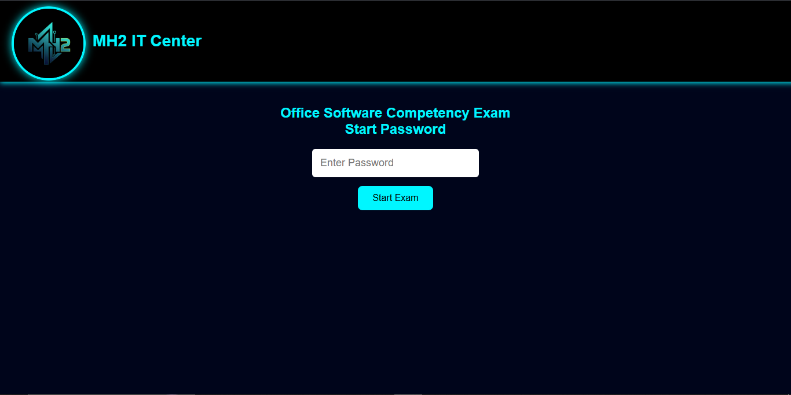
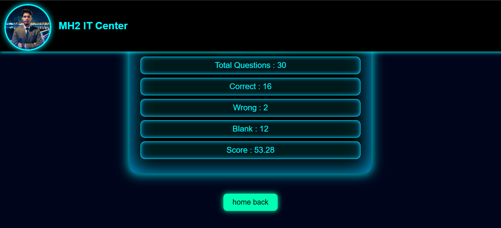

### Uplode Date: <i>13 March 2026</i>

# 🚀 MH2 IT Center MCQ Exam System

A modern **Online MCQ Exam Web Application** developed for **MH2 IT Center**.
This system allows students to take a secure online exam with timer, password protection, auto-save answers, and automatic result calculation.

---
# Demo Preview






## 📌 Features

✅ Password Protected Exam Start

✅ 5 Second Animated Exam Countdown

✅ 30 Minute Exam Timer

✅ Auto Save Answers (Local Storage)

✅ Page Reload Protection

✅ Auto Exam Lock When Time Ends

✅ Automatic Result Calculation

✅ Stylish Dark UI with Animation

✅ Logo Flip Animation

✅ Mobile & Desktop Responsive Design


---

## 🖥️ Built With

* HTML5
* CSS3
* JavaScript
* LocalStorage (for saving exam progress)

---

## 📷 Interface Preview

### 🔐 Start Exam Page

Students must enter the **exam password** to start the test.

### ⏳ Countdown Screen

A **5-second animated countdown** appears before the exam begins.

### 📝 MCQ Exam Page

Students answer **30 computer basic questions** with a **30-minute timer**.

### 📊 Result Page

After submitting or when time ends, the system automatically shows:

* Total Questions
* Correct Answers
* Wrong Answers
* Blank Answers
* Final Score

---

## ⚙️ How to Use

1️⃣ Download or clone the repository

```
git clone https://github.com/YOUR-USERNAME/mh2-it-center-mcq-exam.git
```

2️⃣ Open the project folder

3️⃣ Run the file:

```
index.html
```

4️⃣ Enter the **Start Password** to begin the exam.

---

## 🔐 Default Passwords

Exam Start Password:

```
mh7hridoy
```

Submit Exam Password:

```
1313
```

You can change these passwords inside the **JavaScript code**.

---

## 📂 Project Structure

```
mh2-it-center-mcq-exam
│
├── index.html
├── funtion.js
├── style.css
├── README.md
```

---

## 🎯 Purpose

This project was created to help training centers and institutes conduct **basic computer competency exams online**.

---

## 👨‍💻 Developer

**Murad Hasan Hridoy**
Founder — **MH2 IT Center**

GitHub Profile
https://github.com/mhhridoy7907

---

## ⭐ Support

If you like this project:

⭐ Star the repository
🍴 Fork the project
📢 Share with others

---

## 📜 License

This project is free to use for **educational purposes**.
